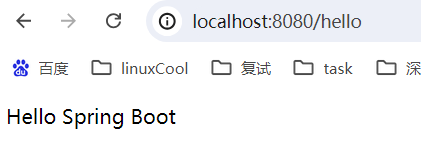
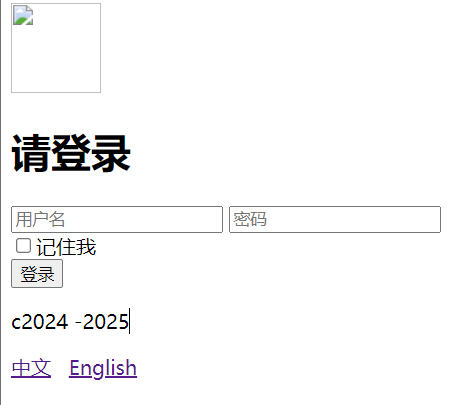
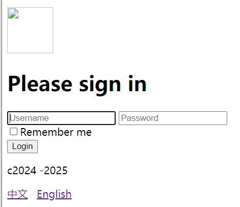

## springboot
### SpringBoot基础回顾
#### 约定优于配置
> Build Anything with Spring Boot: Spring Boot is the starting point for building all Spring-based applications.Spring Boot is designed to get you up and running as quickly as possible，with minimal upfront configuration of spring.

上面是引自官网的一段话，大概是说: SpringBoot是所有基于Spring开发的项目的起点。
SpringBoot的设计是为了让你尽可能快的跑起来Spring应用程序并且尽可能减少你的配置文件。

约定优于配置(Convention over Configuration)，又称按约定编程，是一种软件设计范式。

本质上是说，系统、类库或框架应该假定合理的默认值，而非要求提供不必要的配置。比如说模型中有一个名为User的类，那么数据库中对应的表就会默认命名为user。只有在偏离这一个约定的时候，例如想要将该表命名为person，才需要写有关这个名字的配置。(配置@Table)

比如平时架构师搭建项目就是限制软件开发随便写代码，制定出一套规范，让开发人员按统一的要求进行开发编码测试之类的，这样就加强了开发效率与审查代码效率。所以说写代码的时候就需要按要求命名，这样统一规范的代码就有良好的可读性与维护性了

约定优于配置简单来理解，就是遵循约定
#### SpringBoot概念
##### Spring优缺点分析
- **优点**：
  spring是Java企业版(Java Enterprise Edition，JEE，也称J2EE)的轻量级代替品。无需开发重量级的Enterprise JavaBean(EJB)， Spring为企业级Java开发提供了一种相对简单的方法，通过依赖注入和面向切面编程，用简单的Java对象(Plain Old Java Object,POJO)实现了EJB的功能
- **缺点**:
  虽然Spring的组件代码是轻量级的，但它的配置却是重量级的。一开始，Spring用XML配置，而且是很多XML配置。
  Spring 2.5引入了基于注解的组件扫描，这消除了大量针对应用程序自身组件的显式XML配置。
  Spring3.0引入了基于Java的配置，这是一种类型安全的可重构配置方式，可以代替XML。

所有这些配置都代表了开发时的损耗。因为在思考Spring特性配置和解决业务问题之间需要进行思维切换，所以编写配置挤占了编写应用程序逻辑的时间。
和所有框架一样，Spring实用，但与此同时它要求的回报也不少。

除此之外，项目的依赖管理也是一件耗时耗力的事情。在环境搭建时，需要分析要导入哪些库的坐标，
而且还需要分析导入与之有依赖关系的其他库的坐标，一旦选错了依赖的版本，
随之而来的不兼容问题就会严重阻碍项目的开发进度
##### SpringBoot解决上述spring问题
SpringBoot对上述Spring的缺点进行的改善和优化，基于约定优于配置的思想，可以让开发人员不必在配置与逻辑业务之间进行思维的切换，全身心的投入到逻辑业务的代码编写中，
从而大大提高了开发的效率，一定程度上缩短了项目周期

- 起步依赖
  起步依赖本质上是一个Maven项目对象模型(Project Object Model，POM)，定义了对其他库的传递依赖，这些东西加在一起即支持某项功能。
  
  简单的说，起步依赖就是将具备某种功能的坐标打包到一起，并提供一些默认的功能。自动配置
  
- 自动配置

  springboot的自动配置，指的是springboot，会自动将一些配置类的bean注册进ioc容器，我们可以需要的地方使用@autowired或者@resource等注解来使用它。

  “自动"的表现形式就是我们只需要引我们想用功能的包，相关的配置我们完全不用管，springboot会自动注入这些配置bean，我们直接使用这些bean即可

  springboot:简单、快速、方便地搭建项目;对主流开发框架的无配置集成﹔极大提高了开发、部署效率

#### SpringBoot案例实现

##### 使用Spring Initializer(maven)方式构建Spring Boot项目

本质上说，Spring Initializer是一个Web应用，它提供了一个基本的项目结构，能够帮助我们快速构建一个基础的Spring Boot项目

- pom文件

  ```xml
  <?xml version="1.0" encoding="UTF-8"?>
  <project xmlns="http://maven.apache.org/POM/4.0.0"
           xmlns:xsi="http://www.w3.org/2001/XMLSchema-instance"
           xsi:schemaLocation="http://maven.apache.org/POM/4.0.0 http://maven.apache.org/xsd/maven-4.0.0.xsd">
      <modelVersion>4.0.0</modelVersion>
  
      <parent>
          <groupId>org.springframework.boot</groupId>
          <artifactId>spring-boot-starter-parent</artifactId>
          <version>2.3.11.RELEASE</version>
      </parent>
  
      <groupId>com.pyip</groupId>
      <artifactId>springboot-01-demo</artifactId>
      <version>1.0-SNAPSHOT</version>
      <packaging>war</packaging>
  
      <properties>
          <maven.compiler.source>8</maven.compiler.source>
          <maven.compiler.target>8</maven.compiler.target>
          <project.build.sourceEncoding>UTF-8</project.build.sourceEncoding>
      </properties>
  
      <dependencies>
          <dependency>
              <groupId>org.springframework.boot</groupId>
              <artifactId>spring-boot-starter-web</artifactId>
          </dependency>
      </dependencies>
  
      <build>
          <plugins>
              <plugin>
                  <groupId>org.springframework.boot</groupId>
                  <artifactId>spring-boot-maven-plugin</artifactId>
              </plugin>
          </plugins>
      </build>
  
  </project>
  ```

- 测试接口

  ```java
  @RestController
  public class HelloController {
      @RequestMapping("/hello")
      public String sayHello(){
          return "Hello Spring Boot\n";
      }
  }
  ```

- 测试结果

  

#### 单元测试与热部署

- 单元测试

  开发中，每当完成一个功能接口或业务方法的编写后，通常都会借助单元测试验证该功能是否正确。Spring Boot对项目的单元测试提供了很好的支持，在使用时，需要提前在项目的pom.xml文件中添加spring-boot-starter-test测试依赖启动器，可以通过相关注解实现单元测试
  演示:

  - 1．添加spring-boot-starter-test测试依赖启动器
    在项目的pom.xml文件中添加spring-boot-starter-test测试依赖启动器，示例代码如下︰

    ```xml
            <dependency>
                <groupId>org.springframework.boot</groupId>
                <artifactId>spring-boot-starter-test</artifactId>
                <scope>test</scope>
            </dependency>
    ```

    注意︰使用Spring Initializr方式搭建的Spring Boot项目，会自动加入spring-boot-starter-test测试依赖启动器，无需再手动添加

  - 编写单元测试类和测试方法
    使用Spring Initializr方式搭建的Spring Boot项目，会在src.test.java测试目录下自动创建与项目主程序启动类对应的单元测试类

    ```java
    @SpringBootTest
    @RunWith(SpringRunner.class)
    public class SpringBootDemoTest {
        @Autowired
        private HelloController helloController;
    
        @Test
        public void test01(){
            String result = helloController.sayHello();
            System.out.println(result);// Hello Spring Boot
        }
    }
    ```

- 热部署
  在开发过程中，通常会对一段业务代码不断地修改测试，在修改之后往往需要重启服务，有些服务需要加载很久才能启动成功，这种不必要的重复操作极大的降低了程序开发效率。为此,Spring Boot框架专门提供了进行热部署的依赖启动器，用于进行项目热部署，而无需手动重启项目

  - 演示:1．添加spring-boot-devtools热部署依赖启动器
    在Spring Boot项目进行热部署测试之前，需要先在项目的pom.xml文件中添加spring-boot-devtools热部署依赖启动器:

    ```xml
            <dependency>
                <groupId>org.springframework.boot</groupId>
                <artifactId>spring-boot-devtools</artifactId>
            </dependency>
    ```

    由于使用的是IDEA开发工具，添加热部署依赖可能没有任何效果，接下来还需要对IDEA开发工具进行热部署相关的功能设置。

  - IDEA工具热部署设置

    file->settings->Build,Execution,Deployment->Compiler,打开Build project automaticlly 然后保存退出 

    在项目任意页面中使用组合快捷键"Ctrl+Shift+Alt+/"打开Maintenance选项框，选中并打开Registry页面，列表中到"compiler.automake.allow.when.app.running"，将该选项后的Value值勾选，用于指定IDEA工具在程序运行过程中自动编译，最后单击【Close】按钮完成设置（IDEA2021及之前）

    file->settings->advanced Settings,勾选Allow Auto-make to start even if developed application is currently running，apply并ok

#### 全局配置文件

全局配置文件能够对一些默认配置值进行修改。

Spring Boot使用一个application.properties或者application.yaml的文件作为全局配置文件，该文件存放在src/main/resource目录或者类路径的/config，一般会选择resource目录。接下来，将针对这两种全局配置文件进行讲解

##### application.properties配置文件

使用Spring Initializr方式构建Spring Boot项目时，会在resource目录下自动生成一个空的application.properties文件，Spring Boot项目启动时会自动加载application.properties文件。
我们可以在application.properties文件中定义Spring Boot项目的相关属性，当然，这些相关属性可以是系统属性、环境变量、命令参数等信息，也可以是自定义配置文件名称和位置

```properties
server.port=80B1
spring.datasource.driver-class-name=com.mysql.jdbc.Driverspring.config.additional-location=
spring.config.location=
spring.config.name=application
```

接下来，通过一个案例对Spring Boot项目中application.properties配置文件的具体使用进行讲解

- 演示:
  预先准备了两个实体类文件，后续会演示将application.properties配置文件中的自定义配置属性注入到Person实体类的对应属性中

  - 先在项目的com.lagou包下创建一个pojo包，并在该包下创建两个实体类Pet和Person

    ```java
    public class Pet {
        private String type;
        private String name;
    }
    @Component // 将person作为bean注册到spring ioc容器中
    @ConfigurationProperties(prefix = "person") // 将配置文件中以person开头的属性注入到类中
    public class Person {
        private int id;
        private String name;
        private List hobby;
        private String[] family;
        private Map map;
        private Pet pet;
    }
    ```

    @ConfigurationProperties(prefix = "person")注解的作用是将配置文件中以person开头的属性值通过setXX()方法注入到实体类对应属性中
    @Component注解的作用是将当前注入属性值的Person类对象作为Bean组件放到Spring容器中，只有这样才能被@ConfigurationProperties注解进行赋值

  - 打开项目的resources目录下的application.properties配置文件，在该配置文件中编写需要对Person类设置的配置属性

    ```properties
    person.id=1
    person.name=tom
    person.hobby=吃饭,睡觉,打六花
    person.family=father,mother
    person.map.k1=v1
    person.map.k2=v2
    person.pet.type=dog
    person.pet.name=旺财
    ```

    编写application.properties配置文件时，由于要配置的Person对象属性是我们自定义的，Spring Boot无法自动识别，所以不会有任何书写提示。在实际开发中，为了出现代码提示的效果来方便配置，在使用@ConfigurationProperties注解进行配置文件属性值注入时，可以在pom.xml文件中添加一个Spring Boot提供的配置处理器依赖:

    ```xml
            <dependency>
                <groupId>org.springframework.boot</groupId>
                <artifactId>spring-boot-configuration-processor</artifactId>
            </dependency>
    ```

  - 编写测试代码及测试结果

    ```java
        @Autowired
        private Person person;
        @Test
        public void test02(){
            // Person{id=1, name='tom', hobby=[??, ??, ???], family=[father, mother], map={k1=v1, k2=v2}, pet=Pet{type='dog', name='??'}}
            // Person{id=1, name='tom', hobby=[吃饭, 睡觉, 打六花], family=[father, mother], map={k1=v1, k2=v2}, pet=Pet{type='dog', name='旺财'}}
    
            System.out.println(person.toString());
        }
    ```

    编码问题解决方法：

    file->Settings->Editor->File Encodings,设置Project Encoding,Default encoding properties files为uft8,并勾选Transparent native-to-ascii conversion,保存退出。

##### application.yaml配置文件

YAML文件格式是Spring Boot支持的一种JSON超集文件格式，相较于传统的Properties配置文件，YAML文件以数据为核心，是一种更为直观且容易被电脑识别的数据序列化格式。

application.yaml配置文件的工作原理和application.properties是一样的，只不过yaml格式配置文件看起来更简洁一些。

- application.yaml配置文件
  - YAML文件的扩展名可以使用.yml或者.yaml。
  - application.yml文件使用“key:(空格) value"格式配置属性，使用缩进控制层级关系。

- 针对不同数据类型的属性值，介绍一下YAML

  - (1) value值为普通数据类型（例如数字、字符串、布尔等)
    当YAML配置文件中配置的属性值为普通数据类型时，可以直接配置对应的属性值，同时对于字符串类型的属性值，不需要额外添加引号，示例代码如下

    ```yaml
    server:
    port: 8081path : /hello
    ```

    上述代码用于配置server的port和path属性，port和path属于一个级别

  - (2) value值为数组和单列集合
    当YAML配置文件中配置的属性值为数组或单列集合类型时，主要有两种书写方式︰缩进式写法和行内式写法。

- 在Properties配置文件演示案例基础上，使用yaml文件进行开发

  - yaml文件

    ```yaml
    person:
      id: 2
      name: tom
      hobby: [吃饭,睡觉,打六花]
      family: [father,mother]
      map:
        k1: v1
        k2: v2
    #  map: (k1:v1,k2:v2)
      pet:
        name: 旺财
        type: dog
    ```

  - 运行结果

    ```java
    // Person{id=2, name='tom', hobby=[吃饭, 睡觉, 打六花], family=[father, mother], map={k1=v1, k2=v2}, pet=Pet{type='dog', name='旺财'}}
        @Test
        public void test02(){
            System.out.println(person.toString());
        }
    
    ```

    可以看出，测试方法test02()同样运行成功，并正确打印出了Person实体类对象。
    需要说明的是，本次使用application.yaml配置文件进行测试时需要提前将application.properties配置文件编写的配置注释，这是因为application.properties配置文件会覆盖application.yaml配置文件

#### 配置文件属性值的注入

- 使用Spring Boot全局配置文件设置属性时:
  - 如果配置属性是Spring Boot已有属性，例如服务端口server.port，那么Spring Boot内部会自动扫描并读取这些配置文件中的属性值并覆盖默认属性。
  - 如果配置的属性是用户自定义属性，例如刚刚自定义的Person实体类属性，还必须在程序中注入这些配置属性方可生效。
  - Spring Boot支持多种注入配置文件属性的方式，下面来介绍如何使用注解@ConfigurationProperties和@value注入属性

##### 使用@ConfigurationProperties注入属性
Spring Boot提供的@ConfigurationProperties注解用来快速、方便地将配置文件中的自定义属性值批量注入到某个Bean对象的多个对应属性中。假设现在有一个配置文件，如果使用@ConfigurationProperties注入配置文件的属性，示例代码如下:

```java
@component
@configurationProperties(prefix ="person")
public class Person {
    private int id;/属性的setxx()方法
    public void setId(int id) i
    this.id = id;
}
```

上述代码使用@Component和@ConfigurationProperties(prefix = "person")将配置文件中的每个属性映射到person类组件中。
需要注意的是，使用@ConfigurationProperties

##### 使用@Value注入属性

@Value注解是Spring框架提供的，用来读取配置文件中的属性值并逐个注入到Bean对象的对应属性中，Spring Boot框架从Spring框架中对@Value注解进行了默认继承，所以在Spring Boot框架中还可以使用该注解读取和注入配置文件属性值。

使用@Value注入属性的示例代码如下

```java
@component
public class Person{
    @value("${person.id}")
	private int id;
)
```

上述代码中，使用@Component和@value注入Person实体类的id属性。其中，@Value不仅可以将配置文件的属性注入Person的id属性，还可以直接给id属性赋值，这点是@ConfigurationProperties不支持的

- 演示@Value注解读取并注入配置文件属性的使用:

  - 创建一个实体类Student，并使用@value注解注入属性

    ```java
    @Component
    public class Student {
        @Value("3")
        private int id;
        @Value("${person.name}")
        private String name;
        @Override
        public String toString() {
            return "Student{" +
                    "id=" + id +
                    ", name='" + name + '\'' +
                    '}';
        }
    }
    ```

  - 打开测试类进行测试及测试结果

    ```java
        @Autowired
        private Student student;
        @Test
        public void test03(){
            // Student{id=3, name='tom'}
            System.out.println(student.toString());
        }
    ```

    可以看出，测试方法test03()运行成功，同时正确打印出了Student实体类对象。

    需要说明的是，本示例中只是使用@Value注解对实例中Student对象的普通类型属性进行了赋值演示，而**@Value注解对于包含Map集合、对象以及YAML文件格式的行内式写法的配置文件的属性**注入都不支持，如果赋值会出现错误

#### 自定义配置

​    spring Boot免除了项目中大部分的手动配置，对于一些特定情况，我们可以通过修改全局配置文件以适应具体生产环境，可以说，几乎所有的配置都可以写在application.peroperties文件中，Spring Boot会自动加载全局配置文件从而免除我们手动加载的烦恼。

但是，如果我们自定义配置文件，Spring Boot是无法识别这些配置文件的，此时就需要我们手动加载。接下来，将针对Spring Boot的自定义配置文件及其加载方式进行讲解

##### 使用@Propertysource加载配置文件

​    对于这种加载自定义配置文件的需求，可以使用@PropertySource注解结合@Configuration注解配置类的方式来实现。@PropertySource注解用于指定自定义配置文件的具体位置和名称。同时，为了保证Spring Boot能够扫描该注解，还需要类上添加@Configuration注解将实体类作为自定义配置类。

​     当然，如果需要将自定义配置文件中的属性值注入到对应类的属性中，可以使用@ConfigurationProperties或者@Value注解进行属性值注入

- 演示:

  - (1)打开Spring Boot项目的resources目录，在项目的类路径下新建一个test.properties自定义配置文件，在该配置文件中编写需要设置的配置属性

    ```properties
    #对实体类对象MyProperties进行属性配置
    test.id=110
    test.name=test
    ```

  - (2）在pojo包下新创建一个配置类MyProperties，提供test.properties自定义配置文件中对应的属性,并根据@PropertySource注解的使用进行相关配置

    ```java
    @configuration //自定义配置类
    @PropertySource ("classpath:test.properties")//指定自定义配置文件位置和名称
    @EnableConfigurationProperties(MyProperties.class)//开启对应配置类的属性注入功能
    @ConfigurationProperties(prefix = "test")//指定配置文件注入属性前缀
    public class MyProperties {
        private int id;
        private String name ;
        //省略属性getxx()和setxx()方法
        //省略toString()方法
    }
    ```

  - 代码测试及其结果

    ```java
    @Autowired
    private MyProperties myProperties;
    @Test
        public void test04(){
            // MyProperties{id=110, name='test'}
            System.out.println(myProperties);
        }
    public class Myservice i)
    ```

##### 使用@Configuration编写自定义配置类

​     在Spring Boot框架中，推荐使用配置类的方式向容器中添加和配置组件

​     在Spring Boot框架中，通常使用@Configuration注解定义一个配置类，Spring Boot会自动扫描和识别配置类，从而替换传统Spring框架中的XML配置文件。

​     当定义一个配置类后，还需要在类中的方法上使用@Bean注解进行组件配置，将方法的返回对象注入到Spring容器中，并且组件名称默认使用的是方法名，当然也可以使用@Bean注解的name或value属性自定义组件的名称

- 演示：

  - 在项目下新建一个config包，并在该包下新创建一个类MyService，该类中不需要编写任何代码

    ```java
    public class MyService{
    }
    ```

    创建了一个空的MyService类，而该类目前没有添加任何配置和注解，因此还无法正常被Spring Boot扫描和识别

  - 在项目的config包下，新建一个类MyConfig，并使用@Configuration注解将该类声明一个配置类，内容如下:

    ```java
    @configuration //定义该类是一个配置类
    public class Myconfig {
         //将返回的值对象作为组件添加到Spring容器中，该组件id默认为方法名
        @Bean(name = "iService")
        public MyService myservice( ){
        	return new MyService();
        }
    }
    ```

    MyConfig是@Configuration注解声明的配置类（类似于声明了一个XML配置文件)，该配置类会被Spring Boot自动扫描识别;使用@Bean注解的myService()方法，其返回值对象会作为组件添加到了Spring容器中(类似于XML配置文件中的<bean>标签配置)，并且该组件的id默认是方法名myService

  - 测试及其结果

    ```java
    	@Autowired
        private MyService myService;
        @Autowired
        private ApplicationContext context;
    
        @Test
        public void test05(){
            // com.pyip.springboot01.config.MyService@776802b0
            System.out.println(myService);
        }
        @Test
        public void test06(){
            // true
            System.out.println(context.containsBean("iService"));
        }
    ```

    

#### 随机数设置及参数间引用

​    在Spring Boot配置文件中设置属性时，除了可以像前面示例中显示的配置属性值外，还可以使用随机值和参数间引用对属性值进行设置。

​	下面，针对配置文件中这两种属性值的设置方式进行讲解
##### 随机值设置

​	在Spring Boot配置文件中，随机值设置使用到了Spring Boot内嵌的RandomValuePropertySource类，对一些隐秘属性值或者测试用例属性值进行随机值注入

​	随机值设置的语法格式为${random.xx}，xx表示需要指定生成的随机数类型和范围，它可以生成随机的整数、uuid或字符串,示例代码如下

```properties
my.secret=${random.value}//配置随机值
my.number=${random.int} //配置随机整数
my.bignumber=${random.long)/配置随机long类型数my.uuid=${random.uuid} //配置随机uuid类型数
my.number.less.than.ten=${random.int(10)} //配置小于10的随机整数
my . number.in.range=${random.int [1024,65536]} #配置范围在[1024,65536]之间的随机整数
```

​	上述代码中，使用RandomValuePropertySource类中random提供的随机数类型，分别展示了不同类型随机值的设置示例
##### 参数间引用

​	在Spring Boot配置文件中，配置文件的属性值还可以进行参数间的引用，也就是在后一个配置的属性值中直接引用先前已经定义过的属性，这样可以直接解析其中的属性值了。
​	使用参数间引用的好处就是，在多个具有相互关联的配置属性中，只需要对其中一处属性预先配置，其他地方都可以引用,省去了后续多处修改的麻烦
​	参数间引用的语法格式为${xx}，xx表示先前在配置文件中已经配置过的属性名，示例代码如下

参数间引用的语法格式为${xx}，xx表示先前在配置文件中已经配置过的属性名，示例代码如下

```properties
app.name=MyApp
app.description=${app.name} is a spring Boot application
```

​	上述参数间引用设置示例中，先设置了"app.name=MyApp"，将app.name属性的属性值设置为了MyApp;接着，在app.description属性配置中，使用${app.name}对前一个属性值进行了引用。
​	接下来，通过一个案例来演示使用随机值设置以及参数间引用的方式进行属性设置的具体使用和效果，具体步骤如下

- 演示

  - (1)打开Spring Boot项目resources目录下的application.properties配置文件，在该配置文件中分别通过随机值设置和参数间引用来配置两个测试属性，示例代码如下

    ```properties
    #随机值设置以及参数间引用配置
    tom.age=${random.int[10,20]}
    tom.description=tom的年龄可能是${tom.age}
    ```

    在上述application.properties配置文件中，先使用随机值设置了tom.age属性的属性值，该属性值设置在了[10,20]之间，随后使用参数间引用配置了tom.description属性

  - 打开\项目的测试类，在该测试类中新增字符串类型的description属性，并将配置文件中的tom.description属性进行注入，然后新增一个测试方法进行输出测试，示例代码如下

    ```java
        @Value("${tom.description}")
        private String description;
        @Test
        public void test07(){
            // tom的年龄可能是15
            System.out.println(description);
        }
    ```

    上述代码中，通过@Value("$tom.description}")注解将配置文件中的tom.description属性值注入到了对应的description属性中，在测试方法test07()中对该属性值进行了输出打印。


### SpringBoot原理深入及源码剖析

​	传统的Spring框架实现一个Web服务，需要导入各种依赖JAR包，然后编写对应的XML配置文件等，相较而言，Spring Boot显得更加方便、快捷和高效。那么，Spring Boot究竟如何做到这些的呢?
​	接下来分别针对Spring Boot框架的依赖管理、自动配置和执行流程进行深入分析接下来分别针对Spring Boot框架的依赖管理、自动配置和执行流程进行深入分析

#### 依赖管理

##### 问题:为什么导入dependency时不需要指定版本?

在Spring Boot入门程序中，项目pom.xml文件有两个核心依赖，分别是spring-boot-starter-parent和spring-boot-starter-web，关于这两个依赖的相关介绍具体如下:

- spring-boot-starter-parent依赖
  在01项目中的pom.xml文件中找到spring-boot-starter-parent依赖，示例代码如下:

  ```xml
  	<parent>
          <groupId>org.springframework.boot</groupId>
          <artifactId>spring-boot-starter-parent</artifactId>
          <version>2.3.11.RELEASE</version>
      </parent>
  ```

  上述代码中，将spring-boot-starter-parent依赖作为Spring Boot项目的统一父项目依赖管理，并将项目版本号统一为2.3.11.RELEASE，该版本号根据实际开发需求是可以修改的
  使用"Ctrl+鼠标左键"进入并查看spring-boot-starter-parent底层源文件，发现spring-boot-starter-parent的底层有一个父依赖spring-boot-dependencies，核心代码具体如下

  ```xml
    <parent>
      <groupId>org.springframework.boot</groupId>
      <artifactId>spring-boot-dependencies</artifactId>
      <version>2.3.11.RELEASE</version>
    </parent>
  ```

  使用“Ctrl+鼠标左键”进入并查看spring-boot-dependencies-2.3.11.RELEASE.pom底层源文件，核心代码具体如下

  ```xml
  <!-- 这里指定了默认的版本信息 -->
  <properties>
      <activemq.version>5.15.15</activemq.version>
      ...
      <awaitility.version>4.0.3</awaitility.version>
      ...
      <rabbit-amqp-client.version>5.9.0</rabbit-amqp-client.version>
      ...
      <rsocket.version>1.0.4</rsocket.version>
      ...
      <spring-framework.version>5.2.15.RELEASE</spring-framework.version>
      ...
      <thymeleaf.version>3.0.12.RELEASE</thymeleaf.version>
      ...
      <webjars-locator-core.version>0.45</webjars-locator-core.version>
      ...
      <xmlunit2.version>2.7.0</xmlunit2.version>
    </properties>
  ```

  从spring-boot-dependencies底层源文件可以看出，该文件通过<properties>标签对一些常用技术框架的依赖文件进行了统一版本号管理，例如activemq、 spring、tomcat等，都有与Spring Boot 2.3.11版本相匹配的版本，这也是pom.xml引入依赖文件不需要标注依赖文件版本号的原因。
  需要说明的是，如果pom.xml引入的依赖文件不是spring-boot-starter-parent管理的，那么在pom.xml引入依赖文件时，需要使用<version>标签指定依赖文件的版本号。

##### 项目运行依赖的JAR包是从何而来的?

- spring-boot-starter-web依赖
  查看spring-boot-starter-web依赖文件源码，核心代码具体如下

  ```xml
    <dependencies>
      <dependency>
        <groupId>org.springframework.boot</groupId>
        <artifactId>spring-boot-starter</artifactId>
        <version>2.3.11.RELEASE</version>
        <scope>compile</scope>
      </dependency>
      <dependency>
        <groupId>org.springframework.boot</groupId>
        <artifactId>spring-boot-starter-json</artifactId>
        <version>2.3.11.RELEASE</version>
        <scope>compile</scope>
      </dependency>
      <dependency>
        <groupId>org.springframework.boot</groupId>
        <artifactId>spring-boot-starter-tomcat</artifactId>
        <version>2.3.11.RELEASE</version>
        <scope>compile</scope>
      </dependency>
      <dependency>
        <groupId>org.springframework</groupId>
        <artifactId>spring-web</artifactId>
        <version>5.2.15.RELEASE</version>
        <scope>compile</scope>
      </dependency>
      <dependency>
        <groupId>org.springframework</groupId>
        <artifactId>spring-webmvc</artifactId>
        <version>5.2.15.RELEASE</version>
        <scope>compile</scope>
      </dependency>
    </dependencies>
  ```

  从上述代码可以发现，spring-boot-starter-web依赖启动器的主要作用是提供Web开发场景所需的底层所有依赖

  正是如此，在pom.xml中引入spring-boot-starter-web依赖启动器时，就可以实现Web场景开发，而不需要额外导入Tomcat服务器以及其他Web依赖文件等。当然，这些引入的依赖文件的版本号还是由spring-boot-starter-parent父依赖进行的统一管理。

  Spring Boot除了提供有上述介绍的Web依赖启动器外，还提供了其他许多开发场景的相关依赖，我们可以打开Spring Boot官方文档，搜索"Starters"关键字查询场景依赖启动器

  Spring Boot官方提供了部分场景依赖启动器，这些依赖启动器适用于不同的场景开发，使用时只需要在pox.xml文件中导入对应的依赖启动器即可。

  需要说明的是，Spring Boot官方并不是针对所有场景开发的技术框架都提供了场景启动器，例如数据库操作框架MyBatis、阿里巴巴的Druid数据源等，Spring Boot官方就没有提供对应的依赖启动器。为了充分利用SpringBoot框架的优势，在Spring Boot官方没有整合这些技术框架的情况下，MyBatis、Druid等技术框架所在的开发团队主动与Spring Boot框架进行了整合，实现了各自的依赖启动器，例如**mybatis-spring-boot-starter、druid-spring-boot-starter**等。我们在pom.xml文件中引入这些第三方的依赖启动器时，切记要配置对应的版本号

#### 自动配置（启动流程）

**概念**∶能够在我们添加jar包依赖的时候，自动为我们配置一些组件的相关配置，我们无需配置或者只需要少量配置就能运行编写的项目

##### Spring Boot到底是如何进行自动配置的

Spring Boot应用的启动入口是@SpringBootApplication注解标注类中的main()方法，@SpringBootApplication能够扫描Spring组件并自动配置Spring Boot

下面，查看@SpringBootApplication内部源码进行分析，核心代码具体如下

```java
@SpringBootApplication
public class SpringBootDemo {
    public static void main(String[] args) {
        SpringApplication.run(SpringBootDemo.class,args);
    }
}
@Target({ElementType.TYPE}) // 作用于类、接口、注解或枚举上
@Retention(RetentionPolicy.RUNTIME) // 注解的生命周期，运行时
@Documented // 注解可记录在javadoc中
@Inherited // 可继承
@SpringBootConfiguration // springboot配置类，交由ioc管理
@EnableAutoConfiguration // 开启自动配置
@ComponentScan(           // 包扫描
    excludeFilters = {@Filter(
    type = FilterType.CUSTOM,
    classes = {TypeExcludeFilter.class}
), @Filter(
    type = FilterType.CUSTOM,
    classes = {AutoConfigurationExcludeFilter.class}
)}
)
public @interface SpringBootApplication {
    @AliasFor(
        annotation = EnableAutoConfiguration.class
    )
    Class<?>[] exclude() default {};

    @AliasFor(
        annotation = EnableAutoConfiguration.class
    )
    String[] excludeName() default {};

    @AliasFor(
        annotation = ComponentScan.class,
        attribute = "basePackages"
    )
    String[] scanBasePackages() default {};

    @AliasFor(
        annotation = ComponentScan.class,
        attribute = "basePackageClasses"
    )
    Class<?>[] scanBasePackageClasses() default {};

    @AliasFor(
        annotation = ComponentScan.class,
        attribute = "nameGenerator"
    )
    Class<? extends BeanNameGenerator> nameGenerator() default BeanNameGenerator.class;

    @AliasFor(
        annotation = Configuration.class
    )
    boolean proxyBeanMethods() default true;
}

```

##### @SpringBootConfiguration

​	@SpringBootConfiguration是对Configuration的一层封闭，本质上还是配置类

```java
@Target(ElementType.TYPE)
@Retention(RetentionPolicy.RUNTIME)
@Documented
@Configuration // 配置ioc窗口
@Indexed
public @interface SpringBootConfiguration {
}
```

​	从上述源码可以看出，@SpringBootConfiguration注解内部有一个核心注解@Configuration，该注解是Spring框架提供的，表示当前类为一个配置类(XML配置文件的注解表现形式)，并可以被组件扫描器扫描。由此可见，@SpringBootConfiguration注解的作用与@Configuration注解相同，都是标识一个可以被组件扫描器扫描的配置类，只不过@SpringBootConfiguration是被Spring Boot进行了重新封装命名而已

##### @EnableAutoConfiguration 

​	@EnableAutoConfiguration注解表示开启自动配置功能，该注解是Spring Boot框架最重要的注解，也是实现自动化配置的注解。同样，查看该注解内部查看源码信息，核心代码具体如下：

```java
@Target(ElementType.TYPE)
@Retention(RetentionPolicy.RUNTIME)
@Documented
@Inherited
@AutoConfigurationPackage // 自动配置包
@Import(AutoConfigurationImportSelector.class) // 自动配置扫描注入
public @interface EnableAutoConfiguration {
}


@Target(ElementType.TYPE)
@Retention(RetentionPolicy.RUNTIME)
@Documented
@Inherited
@Import(AutoConfigurationPackages.Registrar.class) // 导入Registrar中注册的组件
public @interface AutoConfigurationPackage { 
}
```

​	从上述源码可以看出，@EnableAutoConfiguration注解是一个组合注解，它主要包括有
@AutoConfigurationPackage和@lmort两个核心注解。

​	在Registrar类中有一个registerBeanDefinitions()方法，使用Debug模式启动项目。也就是说，@AutoConfigurationPackage注解的主要作用是获取项目主程序**启动类所在根目录**，从而**指定后续组件扫描器要扫描的包位置**。因此在定义项目包结构时，要求定义的包结构非常规范，项目主程序启动类要定义在最外层的根目录位置，然后在根目录位置内部建立子包和类进行业务开发，这样才能够保证定义的类能够被组件扫描器扫描。

​	@EnableAutoConfiguration就是从classpath中搜寻**META-INF/spring.factories**配置文件，并将其中org.springframework.boot.autoconfigure.EnableutoConfiguration对应的配置项通过反射(Java Refletion)实例化为对应的标注了@Configuration的JavaConfig形式的配置类，并加载到IOC容器中。

​	以刚刚的项目为例，在项目中加入了Web环境依赖启动器，对应的WebMvcAutoConfiguration自动配置类就会生效，打开该自动配置类会发现，在该配置类中通过全注解配置类的方式对Spring MVC运行所需环境进行了默认配置，包括默认前缀、默认后缀、视图解析器、MVC校验器等。而这些自动配置类的本质是传统Spring MC框架中对应的XML配置文件，只不过在Spring Boot中以自动配置类的形式进行了预先配置。因此，在SpringBoot项目中加入相关依赖启动器后，基本上不需要任何配置就可以运行程序，当然，我们也可以对这些自动配置类中默认的配置进行更改

总结
因此springboot底层实现自动配置的步骤是︰

1. springboot应用启动;

2. @SpringBootApplication起作用;

3. @EnableAutoConfiguration;

4. @AutoConfigurationPackage:

  这个组合注解主要是@lmport(AutoConfigurationPackages.Registrar.class)，它通过将Registrar类导入到容器中，而Registrar类作用是扫描主配置类同级目录以及子包，并将相应的组件导入到springboot创建管理的容器中;

5. @lmport(AutoConfigurationImportSelector.class):

  它通过将AutoConfigurationImportSelector类导入到容器中，AutoConfigurationImportSelector类作用是通过selectlmports方法执行的过程中，会使用内部工具类SpringFactoriesLoader，查找classpath上所有jar包中的META-INF/spring.factories进行加载，实现将配置类信息交给SpringFactory加载器进行一系列的容器创建过程

##### @ComponentScan

配置包扫描及其相关

```java
@Retention(RetentionPolicy.RUNTIME)
@Target(ElementType.TYPE)
@Documented
@Repeatable(ComponentScans.class)
public @interface ComponentScan {
}
```

#### 自定义Starter

##### **SpringBoot starter机制**

​	SpringBoot由众多Starter组成（一系列的自动化配置的starter插件) ，SpringBoot之所以流行，也是因为starter。

​	starter是SpringBoot非常重要的一部分，可以**理解为一个可拔插式的插件**，正是这些starter使得使用某个功能的开发者不需要关注各种依赖库的处理，不需要具体的配置信息，由Spring Boot自动通过classpath路径下的类发现需要的Bean，并织入相应的Bean。

​	例如，你想使用Reids插件，那么可以使用spring-boot-starter-redis;如果想使用MongoDB，可以使用spring-boot-starter-data-mongodb

##### 为什么要自定义starter

​	开发过程中，经常会有一些独立于业务之外的配置模块。如果我们将这些可独立于业务代码之外的功能配置模块封装成一个个starter，复用的时候只需要将其在pom中引用依赖即可，SpringBoot为我们完成自动装配
##### 自定义starter的命名规则

​	SpringBoot提供的starter以spring-boot-starter-xxx的方式命名的。官方建议自定义的starter使用xxx-spring-boot-starter命名规则。以区分SpringBoot生态提供的starter

##### 自定义starter流程

- 自定义starter

  - 新建maven jar工程，工程名为zpyip-spring-boot-starter，导入依赖:

    ```xml
            <dependency>
                <groupId>org.springframework.boot</groupId>
                <artifactId>spring-boot-autoconfigure</artifactId>
                <version>2.3.11.RELEASE</version>
            </dependency>
    ```

  - 编写java Bean

    ```java
    // 第一种方法
    //@EnableConfigurationProperties
    //@ConfigurationProperties(prefix = "simplebean")
    
    // 第二种方法
    @ConfigurationProperties(prefix = "simplebean")
    @Component
    public class SimpleBean {
        private String id;
        private String name;
        // getter,setter...
    }
    ```

  - 编写配置类MyAutoConfiguration

    ```java
    @Configuration
    @ConditionalOnClass
    public class MyAutoConfiguration {
    
        @Bean
        public SimpleBean simpleBean(){
            return new SimpleBean();
        }
    }
    ```

    

  - resources下创建META-INF/spring.factories文件

    ```properties
    org.springframework.boot.autoconfigure.EnableAutoConfiguration=\
    com.pyip.config.MyAutoConfiguration
    ```

- 使用starter

  - 导入自定义starter的依赖

    ```xml
    <!--引入自定义的starter文件-->
            <dependency>
                <groupId>com.pyip</groupId>
                <artifactId>zpyip-spring-boot-starter</artifactId>
                <version>1.0-SNAPSHOT</version>
            </dependency>
    ```

  - 在全局配置文件中配置属性值

    ```properties
    simplebean.id=1
    simplebean.name=lucy
    ```

  - 编写测试方法

    ```java
        @Autowired
        private SimpleBean simpleBean;
        @Test
        public void test08(){
            // com.pyip.pojo.SimpleBean@7a231dfd
            System.out.println(simpleBean);
        }
    ```

#### 执行原理

​	每个Spring Boot项目都有一个主程序启动类，在主程序启动类中有一个启动项目的main()方法，在该方法中通过执行SpringApplication.run()即可启动整个Spring Boot程序。
##### SpringApplication.run方法如何做到启动项目呢?

​	下面我们查看run()方法内部的源码，核心代码具体如下:

```java
@SpringBootApplication
public class SpringBootDemo {
    public static void main(String[] args) {
        SpringApplication.run(SpringBootDemo.class,args);
    }
}
    public static ConfigurableApplicationContext run(Class<?> primarySource, String... args) {
        return run(new Class[]{primarySource}, args);
    }

    public static ConfigurableApplicationContext run(Class<?>[] primarySources, String[] args) {
        return (new SpringApplication(primarySources)).run(args);
    }
```

​	从上述源码可以看出，SpringApplication.run()方法内部执行了两个操作，分别是SpringApplication实例的初始化创建和调用run启动项目

### SpringBoot数据访问

​	SpringData是Spring提供的一个用于简化数据库访问、支持云服务的开源框架，它是一个伞形项目，包含了大量关系型数据库及非关系型数据库的数据访问解决方案，其设计目的是使我们可以快速且简单地使用各种数据访问技术。Spring Boot默认采用整合SpringData的方式统一处理数据访问层，通过添加大量自动配置，引入各种数据访问模板xxxTemplate以及统一的Repository接口，从而达到简化数据访问层的操作。

​	Spring Data提供了多种类型数据库支持，对支持的的数据库进行了整合管理，提供了各种依赖启动器，接下来，通过一张表罗列提供的常见数据库依赖启动器，如表所示。

| 名称                             | 描述                                                  |
| -------------------------------- | ----------------------------------------------------- |
| spring-boot-starter-data-jpa     | 使用Spring Data JPA与Hibernate                        |
| spring-boot-starter-data-mongodb | 使用MongoDB和Spring Data MongoDB                      |
| spring-boot-starter-data-neo4j   | 使用Neo4j图数据库和Spring Data Neo4j                  |
| spring-boot-starter-data-redis   | 使用Redis键值数据存储与Spring Data Redis和Jedis客户端 |

​	除此之外，还有一些框架技术，Spring Data项目并没有进行统一管理, Spring Boot官方也没有提供对应的依赖启动器，但是为了迎合市场开发需求、这些框架技术开发团队自己适配了对应的依赖启动器，例如,**mybatis-spring-boot-starter**支持MyBatis的使用

#### SpringBoot整合MyBatis

​	MyBatis 是一款优秀的持久层框架，Spring Boot官方虽然没有对MyBatis进行整合，但是MyBatis团队自行适配了对应的启动器，进一步简化了使用MyBatis进行数据的操作

​	因为Spring Boot框架开发的便利性，所以实现Spring Boot与数据访问层框架（例如MyBatis)的整合非常简单，主要是引入对应的依赖启动器，并进行数据库相关参数设置即可
##### 基础环境搭建

- 数据准备
  在MySQL中，先创建了一个数据库springbootdata，然后创建了两个表t_article和t_comment并向表中插入数据。其中评论表t_comment的a_id与文章表t_article的主键id相关联。

  ```sql
  create database springbootdata;
  use springbootdata;
  drop table if exists t_article;
  create table t_article(
      id int(20) not null auto_increment comment '文章id',
      title varchar(200) default null comment "文章标题",
      content longtext comment '文章内容',
      primary key(id)
  )Engine=Innodb auto_increment=2 default charset=utf8;
  
  INsert into t_article values ('1','Spring Boot基础入门','从入门到精通');
  INsert into t_article values ('2','Spring cloud基础入门','从入门到精通');
  
  drop table if exists t_comment;
  create table t_comment(
      id int(20) not null auto_increment comment '评论id',
      content longtext comment '评论内容',
      author varchar(200) default null comment '评论作者',
      a_id int(20) default null comment '关联的文章id',
      primary key (id)
  )Engine=Innodb auto_increment=2 default charset=utf8;
  INsert into t_comment values ('1','很全，很详细','luccy','1');
  INsert into t_comment values ('2','赞一个','tom','1');
  INsert into t_comment values ('3','很详细','eric','1');
  INsert into t_comment values ('4','很好，非常详细','张三','1');
  INsert into t_comment values ('5','很不错','李四','2');
  ```

- 创建工程，并导入依赖

  ```xml
      <dependencies>
          <dependency>
              <groupId>org.mybatis.spring.boot</groupId>
              <artifactId>mybatis-spring-boot-starter</artifactId>
              <version>2.1.1</version>
          </dependency>
          <dependency>
              <groupId>mysql</groupId>
              <artifactId>mysql-connector-java</artifactId>
              <version>8.0.30</version>
          </dependency>
      </dependencies>
  ```

- 编写实体类

  ```java
  public class Comment {
      private Integer id;
      private String content;
      private String author;
      private Integer aId;
  }
  public class Article {
      private Integer id;
      private String content;
      private String title;
  }
  ```

- 编写配置文件

  - 在application.properties配置文件中进行数据库连接配置

    ```properties
    jdbc.driver=com.mysql.cj.jdbc.Driver
    jdbc.url=jdbc:mysql://localhost:3306/springbootdata?serverTimezone=UTC&characterEncoding=utf8&useUnicode=true&useSSL=false
    jdbc.username=root
    jdbc.password=10086
    ```

##### 注解方式整合Mybatis

  - (1)创建一个用于对数据库表t_comment数据操作的接口CommentMapper
    ```java
    @Mapper
    public interface CommentMapper {
        @Select("SELECT * FROM t_comment WHERE id = #{id}")
        public Comment findById(Integer id);
    }
    ```

    ​	@eMapper注解表示该类是一个MyBatis接口文件，并保证能够被Spring Boot自动扫描到spring容器中

    ​	对应的接口类上添加了@Mapper注解，如果编写的Mapper接口过多时，需要重复为每一个接口文件添加@Mapper注解

    ​	为了解决这种麻烦，可以直接在spring Boot项目启动类上添加@MapperScan ( "xxx")注解，不需要再逐个添加@Mapper注解，@MapperScan ( "xxx"”)注解的作用和Mapper注解类似，但是它必须指定需要扫描的具体包名

  - (2〕编写测试方法及测试结果
    
    ```java
    @RunWith(SpringRunner.class)
    @SpringBootTest
    public class SpringBootApplicationTest {
        @Autowired
        public CommentMapper commentMapper;
    
        @Test
        public void test01(){
            Comment comment = commentMapper.findById(1);
            // Comment(id=1, content=很全，很详细, author=luccy, aId=null)
            System.out.println(comment);
        }
    }
    ```
    
    ​	控制台中查询的Comment的ald属性值为null，没有映射成功。这是因为编写的实体类Comment中使用了驼峰命名方式将t_comment表中的a_id字段设计成了ald属性，所以无法正确映射查询结果。
    
    ​	为了解决上述由于**驼峰命名**方式造成的表字段值无法正确映射到类属性的情况，可以在Spring Boot全局配置文件application.properties中添加开启驼峰命名匹配映射配置，示例代码如下
    
    ```properties
    mybatis.configuration.map-underscore-to-camel-case=true
    ```
    
    打印结果
    
    ```java
    // Comment(id=1, content=很全，很详细, author=luccy, aId=1)
    ```

##### 配置文件方式整合Mybatis

- (1)创建一个用于对数据库表t_article数据操作的接口ArticleMapper
  
  ```java
  @Mapper
  public interface ArticleMapper {
      public List<Article> selectArticle();
  }
  ```
  
- (2)创建XML映射文件
  
  ​	resources目录下创建一个统一管理映射文件的包mapper，并在该包下编写与ArticleMapper接口方应的映射文件ArticleMapper.xml
  
  ```xml
  <?xml version="1.0" encoding="utf-8" ?>
  <!DOCTYPE mapper PUBLIC "-//mybatis.org//DTD Mapper 3.0//EN" "http://mybatis.org/dtd/mybatis-3-mapper.dtd">
  <mapper namespace="com.pyip.demo03.mapper.ArticleMapper">
      <select id="selectArticle" resultType="Article">
          select * from t_article;
      </select>
  </mapper>
  ```
  
- (3〉配置XML映射文件路径。
  
  ​	在项目中编写的XML映射文件，Spring Boot并无从知晓，所以无法扫描到该自定义编写的XML配置文件，还必须在全局配置文件application.properties中添加MyBatis映射文件路径的配置，同时需要添加实体类别名映射路径，示例代码如下
  
  ```properties
  mybatis.mapper-locations=classpath:mapper/*.xml
  mybatis.type-aliases-package=com.pyip.demo03.pojo
  ```
  
- (4)编写单元测试进行接口方法测试

  ```java
      @Autowired
      public ArticleMapper articleMapper;
  
      @Test
      public void test02(){
         // Article(id=1, content=从入门到精通, title=Spring Boot基础入门)
         // Article(id=2, content=从入门到精通, title=Spring cloud基础入门)
          List<Article> articles = articleMapper.selectArticle();
          for (Article article : articles) {
              System.out.println(article);
          }
      }
  ```

#### SpringBoot整合JPA

- 添加SpringDataJPA依赖启动器。在项目的pom.xml文件中添加Spring Data JPA依赖启动器，如下

  ```xml
          <dependency>
              <groupId>org.springframework.boot</groupId>
              <artifactId>spring-boot-starter-data-jpa</artifactId>
          </dependency>
  ```

- 编写ORM实体类

  ```java
  @Data
  @ToString
  @Entity(name = "t_comment")
  public class Comment {
      @Id
      @GeneratedValue(strategy = GenerationType.IDENTITY)
      private Integer id;
      private String content;
      private String author;
      @Column(name = "a_id")
      private Integer aId;
  }
  ```

- 编写Repository接口：CommentRepository

  ```java
  public interface CommentRepository extends JpaRepository<Comment,Integer> {
  }
  ```

- 测试

  ```java
  @Autowired
      private CommentRepository commentRepository;
      @Test
      public void test03(){
          /**
           * Comment(id=1, content=很全，很详细, author=luccy, aId=1)
           * Comment(id=2, content=赞一个, author=tom, aId=1)
           * Comment(id=3, content=很详细, author=eric, aId=1)
           * Comment(id=4, content=很好，非常详细, author=张三, aId=1)
           * Comment(id=5, content=很不错, author=李四, aId=2)
           */
          List<Comment> all = commentRepository.findAll();
          for (Comment comment : all) {
              System.out.println(comment);
          }
      }
  ```

#### SpringBoot整合Redis

​	除了对关系型数据库的整合支持外，Spring Boot对非关系型数据库也提供了非常好的支持。Spring Boot与非关系型数据库Redis的整合使用

- (1）添加Spring Data Redis依赖启动器。先在项目的pom.xml文件中添加Spring Data Redis依赖启动器，示例代码如下

  ```xml
          <dependency>
              <groupId>org.springframework.boot</groupId>
              <artifactId>spring-boot-starter-data-redis</artifactId>
          </dependency>
  ```

- 编写实体类，此处为了演示Spring Boot与Redis数据库的整合使用，添加一些实体类

  ```java
  public class Address {
      @Indexed
      private String city;
      @Indexed
      private String country;
  }
  
  @RedisHash("persons")
  public class Person {
      @Id
      private String id;
      @Indexed
      private String firstname;
      @Indexed
      private String lastname;
      private Address address;
  }
  ```

  实体类示例中，针对面向Redis数据库的数据操作设置了几个主要注解，这几个注解的说明如下∶

  - @RedisHash("persons"):用于指定操作实体类对象在Redis数据库中的存储空间，此处表示针对Person实体类的数据操作都存储在Redis数据库中名为persons的存储空间下。
  - @ld:用于标识实体类主键。在Redis数据库中会默认生成字符串形式的HashKey表示唯一的实体对象id,当然也可以在数据存储时手动指定id。
  - @Indexed:用于标识对应属性在Redis数据库中生成二级索引。使用该注解后会在Redis数据库中生成属性对应的二级索引，索引名称就是属性名，可以方便的进行数据条件查询。

- (3)编写Repository接口。Spring Boot针对包括Redis在内的一些常用数据库提供了自动化配置，可以通过实现Repository接口简化对数据库中的数据进行增删改查操作

  ```java
  public interface PersonRepository extends CrudRepository<Person,String> {
      List<Person> findByAddress_City(String 北京);
  }
  ```

  - 需要说明的是，在操作Redis数据库时编写的Repository接口文件需要继承最底层的CrudRepository接口而不是继承JpaRepository，这是因为JpaRepository是Spring Boot整合JPA特有的。当然，也可以在项目pom.xml文件中同时导入Spring Boot整合的JPA依赖和Redis依赖，这样就可以编写一个继承JpaRepository的接口操作Redis数据库

- Redis数据库连接配置。在项目的全局配置文件application.properties中添加Redis数据库的连接配置，示例代码如下

  ```properties
  spring.redis.host=127.0.0.1
  spring.redis.port=6379
  spring.redis.password= # 默认为空
  ```

- 测试与结果

  ```java
      @Autowired
      private PersonRepository personRepository;
      @Test
      public void test03(){
          Person person = new Person();
          person.setFirstname("张");
          person.setLastname("三");
          Address address = new Address();
          address.setCity("北京");
          address.setCountry("中国");
          person.setAddress(address);
          personRepository.save(person);
      }
      @Test
      public void test04(){
          List<Person> list = personRepository.findByAddress_City("北京");
          for (Person person : list) {
              // Person(id=294d1e3e-fbab-40b3-827e-64a101b85df0, firstname=张, lastname=三, address=Address(city=北京, country=中国))
              System.out.println(person);
          }
      }
  ```

  执行test03()方法添加的数据在Redis数据库中存储成功。另外，在数据库列表左侧还生成了一些类似address.city、firstname、lastname等二级索引，这些二级索引是前面创建Person类时在对应属性上添加@Indexed注解而生成的。同时，由于在Redis数据库中生成了对应属性的二级索引，所以可以通过二级索引来查询具体的数据信息，例如repository.findByAddress_City(""北京")通过address.city索引查询索引值为“北京"的数据信息。**如果没有设置对应属性的二级索引，那么通过属性索引查询数据结果将会为空**

### SpringBoot视图技术

​	前端模板引擎技术的出现，使前端开发人员无需关注后端业务的具体实现，只关注自己页面的呈现效果即可，并且解决了前端代码错综复杂的问题、实现了前后端分离开发。Spring Boot框架对很多常用的模板引擎技术(如: FreeMarker、Thymeleaf、Mustache等)提供了整合支持

- Spring Boot不太支持常用的JSP模板，并且没有提供对应的整合配置，这是因为使用嵌入式Servlet容器的Spring Boot应用程序对于JSP模板存在一些限制:

  - Spring Boot默认使用嵌入式Servlet容器以JAR包方式进行项目打包部署，这种JAR包方式不支持JSP模板。

  - 如果使用Undertow嵌入式容器部署Spring Boot项目，也不支持JSP模板。

  - Spring Boot默认提供了一个处理请求路径"/error"的统一错误处理器，返回具体的异常信息。使用JSP模板时，无法对默认的错误处理器进行覆盖，只能根据Spring Boot要求在指定位置定制错误页面。

    上面对Spring Boot支持的模板引擎进行了介绍，并指出了整合JSP模板的一些限制。接下来，对其中常用的Thymeleaf模板引擎进行介绍，并完成与Spring Boot框架的整合实现

#### Thymeleaf

Thymeleaf是一种现代的基于服务器端的Java模板引擎技术，也是一个优秀的面向Java的XML、XHTML、HTML5页面模板，它具有丰富的标签语言、函数和表达式，在使用Spring Boot框架进行页面设计时，一般会选择Thymeleaf模板

##### Thymeleaf语法

**常用标签**

在HTML页面上使用Thymeleaf标签，Thymeleaf标签能够动态地替换掉静态内容，使页面动态展示。
为了大家更直观的认识ThymeleafHTMLThymeleaf，下面展示一个在HTML文件中嵌入了Thymeleaf的页面文件，示例代码如下:

```html
<!Document html>
<html lang="en" xmlns:th="http://www.thymeleaf.org">
<head>
    
    </head>
    <meta charset="utf-8">
    <link rel="stylesheet" type="text/css" media="all" href="../../css/gtvg.css" th:href="@{/css/gtvg.css}"
          <title>Title</html>title>
</head>
<body>
    <p th:text="${hello}">
        欢迎进入Thymeleaf的学习
    </p>
</body>
</html>

```

上述代码中，xmIns:th="http://www.thymeleaf.org"用于引入Thymeleaf模板引擎标签，使用关键字"th"标注标签是Thymeleaf模板提供的标签，其中，"th:href"用于引入外联样式文件，"th:text"用于动态显示标签文本内容。

除此之外，Thymeleaf模板提供了很多标签，接下来，通过一张表罗列Thymeleaf的常用标签

| th:标签    | 说明                                |
| ---------- | ----------------------------------- |
| th:insert  | 布局标签，替换内容到引入的文件      |
| th:replace | 布局标签，替换整个标签到引入的文件  |
| th:each    | 元素遍历（类似JSP中的c:forEach标签) |
| th:if      | 条件判断，如果为真                  |
| th:unless  | 条件判断，如果为假                  |
| th:switch  | 条件判断，进行选择性匹配            |
| th:case    | 条件判断，进行选择性匹配            |
| th:value   | 属性值修改，指定标签属性值          |
| th:href    | 用于设定链接地址                    |
| th:src     | 用于设定链接地址                    |
| th:text    | 用于指定标签显示的文本内容          |

**标准表达式**
Thymeleaf模板引擎提供了多种标准表达式语法．在正式学习力前．先通讨一张表来展示其主要语法及说明

| 说明           | 表达式语法 |
| -------------- | ---------- |
| 变量表达式     | ${...}     |
| 选择变量表达式 | *{...}     |
| 消息表达式     | #{...}     |
| 链接URL表达式  | @{...}     |
| 片段表达式     | ~{...}     |

**1.变量表达式${...}**
变量表达式${...}主要用于获取上下文中的变量值，示例代码如下:

```html
<p th:text="${title}">这是标题</p>
```

示例使用了Thymeleaf模板的变量表达式${...}用来动态获取P标签中的内容，如果当前程序没有启动或者当前上下文中不存在title变量，该片段会显示标签默认值"这是标题";如果当前上下文中存在title变量并且程序已经启动，当前P标签中的默认文本内容将会被title变量的值所替换，从而达到模板引擎页面数据动态替换的效果同时, Thymeleaf为变量所在域提供了一些内置对象，具体如下所示

```properties
# ctx:上下文对象
# vars: 上下文变量
# locale:上下文区域设置
# request:(仅限web context) HttpservletRequest对象
# response:(仅限web context) HttpservletResponse对象
# session:(仅限web context) Httpsession对象
# servletContext:(仅限web Context) servletContext对象
```

结合上述内置对象的说明，假设要在Thymeleaf模板引擎页面中动态获取当前国家信息，可以使用#locale内置对象，示例代码如下

```html
The locale country is:<span th:text="${#locale.country } ">US</span>.
```


上述代码中，使用th:text="${#locale.country)"动态获取当前用户所在国家信息，其中<span>标签内默认内容为US(美国)，程序启动后通过浏览器查看当前页面时，Thymeleaf会通过浏览器语言设置来识别当前用户所在国家信息，从而实现动态替换

**2.选择变量表达式  *{...}**

选择变量表达式和变量表达式用法类似，一般用于从被选定对象而不是上下文中获取属性值，如果没有选定对象，则和变量表达式—样，示例代码如下

```html
<div th:object="${book}">
	<p>titile: <span th:text=”*{title}">标题</span>.</p>
</div>
```

*{title}选择变量表达式获取当前指定对象book的title属性值。
**3.消息表达式#{...}**

消息表达式#{...}主要用于Thymeleaf模板页面国际化内容的动态替换和展示，使用消息表达式#{...}进行国际化设置时，还需要提供一些国际化配置文件。关于消息表达式的使用，后续会详细说明
**4.链接表达式@{..}**

链接表达式@{...}一般用于页面跳转或者资源的引入，在Web开发中占据着非常重要的地位，并且使用也非常频繁，示例代码如下:

```html
<a th:href="@{http://localhost:8080/order/details(orderId=${o.id))}">view</a>
<a th:href="@{/order/details(orderId=${o.id})}">view</a>
```


上述代码中，链接表达式@{...}分别编写了绝对链接地址和相对链接地址。在有参表达式中，需要按照@{路径(参数名称=参数值，参数名称=参数值...)的形式编写，同时该参数的值可以使用变量表达式来传递动态参数值。

**5.片段表达式~{...}**
片段表达式~{...}用来标记一个片段模板，并根据需要移动或传递给其他模板。其中，最常见的用法是使用th:insert或th:replace属性插入片段，示例代码如下:

```html
<div th:insert="~{thymeleafDemo::title}"></div>
```

上述代码中，使用th:insert属性将title片段模板引用到该<div>标签中。thymeleafDemo为模板名称，Thymeleaf会自动查找""/resources/templates"目录下的thymeleafDemo模板,title为片段名称

##### 基本使用

- Thymeleaf模板基本配置

  - 首先，在Spring Boot项目中使用Thymeleaf模板，引入依赖

    ```xml
            <dependency>
                <groupId>org.springframework.boot</groupId>
                <artifactId>spring-boot-starter-thymeleaf</artifactId>
                <version>2.3.11.RELEASE</version>
            </dependency>
    ```

  - 其次，在全局配置文件中配置Thymeleaf的参数

    ```properties
    spring.thymeleaf.cache=true
    spring.thymeleaf.encoding=utf-8
    spring.thymeleaf.mode=HTML5
    spring.thymeleaf.prefix=classpath:/template/
    spring.thymeleaf.suffix=.html
    ```

    上述配置中，spring.thymeleaf.cache表示是否开启Thymeleaf模板缓存，默认为true，在开发过程中通常会关闭缓存，保证项目调试过程中数据能够及时响应;

    spring.thymeleaf.prefix指定了Thymeleaf模板页面的存放路径，默认为classpath:/templates/; 

    spring.thymeleaf.suffix指定了Thymeleaf模板页面的名称后缀，默认为.html

- 静态资源的访问

  开发Web应用时，难免需要使用静态资源。Spring boot默认设置了静态资源的访问路径。
  使用Spring Initializr方式创建的Spring Boot项目，默认生成了一个resources目录，在resources目录中新建public、resources、static三个子目录下，Spring boot默认会挨个从public、resources、static里面查找静态资源

##### 完成数据的页面展示 

- 创建Spring Boot项目，引入Thymeleaf依赖

- 编写配置文件

  打开application.properties文件，写入内容

  ```properties
  spring.thymeleaf.cache=false
  spring.thymeleaf.encoding=utf-8
  spring.thymeleaf.mode=HTML5
  spring.thymeleaf.prefix=classpath:/template/
  spring.thymeleaf.suffix=.html
  ```

  使用"spring.thymeleaf.cache=false"用来关闭页面缓存

- 创建web控制类

  ```java
  @Controller
  public class LoginController {
      @RequestMapping("/toLoginPage")
      public String toLoginPage(Model model){
          model.addAttribute("currentYear", Calendar.getInstance().get(Calendar.YEAR));
          return "login";
      }
  }
  ```

- 创建模板页面并引入静态资源文件

  在"classpath:/template/"目录下引入一个用户登录的模板页面login.html

  ```html
  <!DOCTYPE html>
  <html lang="en" xmlns:th="http://www.thymeleaf.org">
  <head>
      <meta http-equiv="content-Type" content="text/html; charset=UTF-8">
      <meta name="viewport" content="width=device-width，initial-scale=l, shrink-to-fitmno">
      <title>用户登录界面</title>
      <link th:href="@{/login/css/bootstrap.min.css}" rel="stylesheet">
      <link th:href="@{/login/css/signin.css}" rel="stylesheet">
  </head>
  <body class="text-center">
  <!--用户登录form表单-->
  <form class="form-signin">
      
      <h1 class="h3 mb-3 font-weight-normal">请登录</h1>
      <input type="text" class="form-control"
             th:placeholder="用户名" required="" autofocus="">
      <input type="password" class="form-control"
             th:placeholder="密码" required="">
      <div class="checkbox mb-3">
          <label>
              <input type="checkbox" value="remember-me">记住我
          </label>
      </div>
      <button class="btn btn-lg btn-primary btn-block" type="submit">登录</button>
      <p class="mt-5 mb-3 text-muted">c<span th:text="${currentYear}">2019</span>-<span
              th:text="${currentrear}+1">2020</span></p>
  </form>
  </body>
  </html>
  ```

  通过"xmIns:th="http://www.thymeleaf.org""引入了Thymeleaf模板标签;

  使用"th:href"和"th:src"分别引入了两个外联的样式文件和一个图片;

  使用"th:text"引入了后台动态传递过来的当前年份currentYear

- 效果测试

  

##### 配置国际化页面

###### 编写多语言国际化配置文件

​	在项目的类路径resourcs下创建名称为i18n的文件夹，并在该文件夹中根据需要编写对应的多语言国际化login.properties、login_zh_CN.properties和login_en_US.properties文件

```properties
# login.properties
login.tip=请登录
login.username=用户名
login.password=密码
login.rememberme=记住我
login.button=登录
# login_zh_CN.properties
login.tip=请登录
login.username=用户名
login.password=密码
login.rememberme=记住我
login.button=登录
# login_en_US.properties
login.tip=Please sign in
login.username=Username
login.password=Password
login.rememberme=Remember me
login.button=Login

```

​	login.properties为自定义默认语言配置文件，login_zh_CN.properties为自定义中文国际化文件，login_en_us.properties为自定义英文国际化文件

​	需要说明的是，Spring Boot默认识别的语言配置文件为类路径resources下的messages.properties，其他语言国际化文件的名称必须严格按照"文件前缀名语言代码国家代码.properties"的形式命名

​	本示例中，在项目类路径resources下自定义了一个i18n包用于统一配置管理多语言配置文件，并将项目默认语言配置文件名自定义为login.properties，因此，后续还必须在项目全局配置文件中进行国际化文件基础

###### 编写配置文件

在application.properties中添加国际化配置信息

```properties
# application.properties
spring.messages.basename=i18n.login
```

改造html页面

```html
    
    <h1 class="h3 mb-3 font-weight-normal" th:text="#{login.tip}">登录</h1>
    <input type="text" class="form-control"
           th:placeholder="#{login.username}" required="" autofocus="">
    <input type="password" class="form-control"
           th:placeholder="#{login.password}" required="">
    <div class="checkbox mb-3">
        <label>
            <input type="checkbox" value="remember-me" >[[#{login.rememberme}]]
        </label>
    </div>
    <button class="btn btn-lg btn-primary btn-block" type="submit" th:text="#{login.button}">登录</button>
    <p class="mt-5 mb-3 text-muted">c<span th:text="${currentYear}">2019</span>
        -<span th:text="${currentYear}+1">2020</span></p>
```

###### 定制区域信息解析器

​	在完成上一步中多语言国际化文件的编写和配置后，就可以正式在前端页面中结合Thymeleaf模板相关属性进行国际化语言设置和展示了，不过这种实现方式默认是使用请求头中的语言信息（浏览器语言信息〉自动进行语言切换的，有些项目还会提供手动语言切换的功能，这就需要定制区域解析器了

- 添加切换路径

  ```html
      <a th:href="@{/toLoginPage(l='zh_CN')}">中文</a>&nbsp;&nbsp;
      <a th:href="@{/toLoginPage(l='en_US')}">English</a>
  ```

- 配置切换解析器

  - 在项目中创建名为onfig的包，并在该包下创建一个用于定制国际化功能区域信息解析器的自定义配置类MyLocalResovel

    ```java
    public class MyLocalResolver implements LocaleResolver {
        //解析请求
        @Override
        public Locale resolveLocale(HttpServletRequest request) {
            //获取请求参数
            String lang = request.getParameter("l");
            Locale locale = Locale.getDefault();//如果没有就用默认的
            //如果请求链接携带了国际化的参数
            if (!StringUtils.isEmpty(lang)){
                //zh_CN
                String[] split = lang.split("_");
                //国家，地区
                locale= new Locale(split[0], split[1]);
            }else{
                String header = request.getHeader("Accept-Language");
                String[] split = header.split(",");
                String[] split1 = split[0].split("-");
                locale = new Locale(split1[0],split1[1]);
            }
            return locale;
        }
        @Override
        public void setLocale(HttpServletRequest request, HttpServletResponse response, Locale locale) {
        }
    }
    ```

  - 将MyLocalResolver解析器使用ioc管理

    ```java
    @Configuration
    public class MyConfig implements WebMvcConfigurer {
        //自定义国际化主键就生效了
        @Bean
        public LocaleResolver localeResolver(){
            return new MyLocalResolver();
        }
    }
    ```

  - 效果及展示（没有样式源码）

    中文

    

    英文

    

### SpringBoot缓存管理
#### 默认缓存管理
#### 自定义Redis缓存序列化机制
##### 自定义RedisTemplate
##### 自定义RedisCacheManager