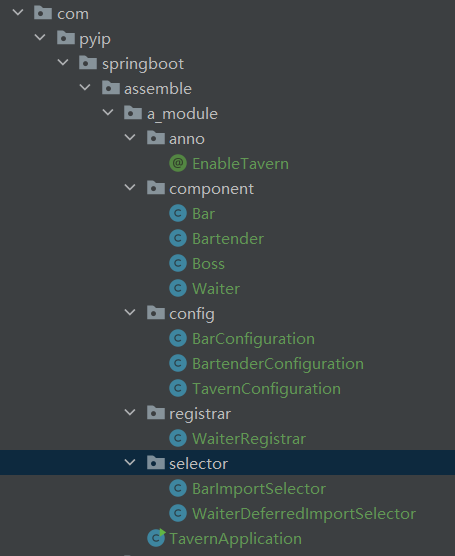
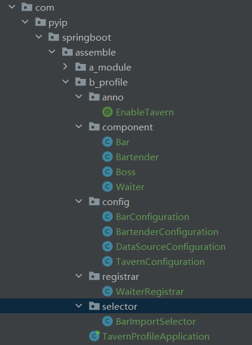
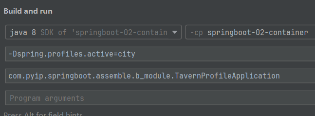
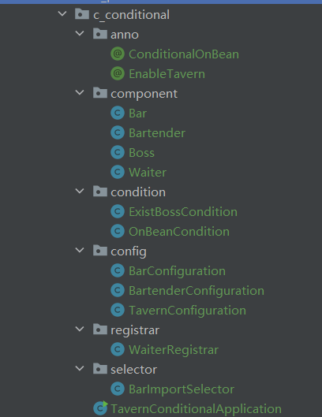

### 本章总结
- springboot的自动装配
  - 组件装配
  - spring模块装配
#### 组件装配
- spring本身有一个ioc容器，它会统一管理其中的bean对象，bean对象可以理解为组件
##### 组件
  - 当spring配合第三方技术时，要把第三方框架的核心api配置到spring的配置文件或注解配置类中，以供spring统一管理
  - ioc中的核心api对象本身就是一个个的bean对象，即组件
  - 将核心api配置到xml配置文件或注解配置类的行为就是组件装配
  - spring只有一种组件装配方式，即<b>手动装配</b>,springboot基于原生的手动装配，通过模块装配+条件装配+spi机制，可以完美实现组件的自动装配
##### 手动装配
  - 手动装配，就是开发人员在项目中通过编写xml配置文件，注解配置类，配合特定注解等方式，将组件注册到ioc中
  - 基于xml配置文件的手动装配
  
    ```xml
    <bean id="person" class="com.pyip.springboot.component.Person"
    ```
  
  - 基于注解配置类的手动装配
  
    ```java
    @Configuration
    public class ExampleConfiguration{
        @Bean
        public Person person(){
            return new Person();
        }
    }
    ```
  
  - 基于组件扫描的手动装配
  
    ```java
    @Component
    public class DemoService{}
    @Configuration
    @ComponentScan("com.pyip.springboot")
    public class ExampleConfiguration{}
    ```
  - 从这三种手动装配方式中可以看出，<b>手动装配都需要亲自编写配置信息，将组件注册到IOC容器中</b>

##### 自动装配
- springboot的核心特性之一就是组件的<b>自动装配</b>

- 自动装配的核心就是，本来需要开发人员自己编写的配置，转为框架自动根据项目中整合的场景依赖，合理判断并装配合适的Bean到IOC容器中

- 自动装配关注的重点是整合的场景，而不是每个具体的场景所需要的组件，所以自动装配更考虑应用全局的组件配置

- springboot自动装配具有非侵入性，它会合理替代默认的组件注册（覆盖默认配置）
> 当整合spring-jdbc时，如果项目中已经注册了JdbcTemplate,则springboot提供的默认的JdbcTemplate就不会创建

- springboot自动装配可以实现配置禁用，在@SpringBootApplication或者@EnableAutoConfiguration注解上标注exclude/excludeName属性，可以禁用默认的自动配置类。其禁用方式在springboot全局配置文件中声明spring.autoconfiguration.exclude属性时同样试用。

#### spring模块装配
- 模块装配是自动装配的核心，它可以把<b>一个模块所需的核心功能组件都装配到IOC容器中</b>，并保证方式尽可能简单
- 通过注解，如@EnableXXX系列注解，可以实现快速激活和装配对应的模块
  
##### 模块
- 模块可以理解成一个个可分解，组合，更换的独立单元
- 特性
  - 独立
  - 功能高内聚
  - 可相互依赖
  - 目标明确
##### 快速模块装配
- 模块装配核心原则:<b>自定义注解+@Import导入组件</b>

- 模块装配场景：构建一个酒馆，酒馆里有吧台，调酒师，服务员和老板。
  - <b>通过一个注解，将以上元素全部填充到酒馆中</b>
  
- @EnableTavern注解声明
    ```java
    @Documented // @Documented只能用在注解上，
    @Retention(RetentionPolicy.RUNTIME) // 表示注解将在运行时保留，允许通过反射获取注解信息。
    @Target(ElementType.TYPE) // 该注解只能作用于类上 指定被修饰的Annotation可以放置的位置(被修饰的目标)
    public @interface EnableTavern {
    }
    ```
  - 要使@EnableTavern注解发挥作用，需要配合模块装配中的最核心注解<b>@Import</b>
  - 该注解标注在@EnableTavern上，且需要传入value属性的值。
  - @Import注解可以导入<b>配置类，ImportSelector的实现类，ImportBeanDefinitionRegistrar的实现类及普通类</b>
  
##### 导入老板类-普通类
  - <b>如果一个配置类上标注了@EnableTaven注解，就会触发@Import的效果，向容器中导入一个Boss类的Bean</b>
  ```java
    public class Boss {
    }
    @Documented // @Documented只能用在注解上，
    @Retention(RetentionPolicy.RUNTIME) // 表示注解将在运行时保留，允许通过反射获取注解信息。
    @Target(ElementType.TYPE) // 该注解只能作用于类上 指定被修饰的Annotation可以放置的位置(被修饰的目标)
    @Import(Boss.class)
    public @interface EnableTavern {
    }
  ```

- 创建配置类
  - 注解驱动的测试离不开配置类，创建一个标注了@Configuration和@EnableTavern注解的类
  ```java
    @Configuration
    @EnableTavern
    public class TavernConfiguration {
    }
  ```
  
- 编写启动测试
  - 编写一个测试启动类，检验组件装配的效果
  ```java
  public class TavernApplication {
    public static void main(String[] args) {
    AnnotationConfigApplicationContext ctx = new AnnotationConfigApplicationContext(TavernConfiguration.class);
    Boss boss = ctx.getBean(Boss.class);
    System.out.println(boss); // com.pyip.springboot.assemble.a_module.component.Boss@6107227e
    }
  }
  ```
##### 导入配置类-配置类
- 当@Import传入的是普通类时，通过手动装配的@Configuration+@Bean就能完成，但其他类也需要传入时，手动装配的这种方法就不太够应对了
- 声明调酒师类
  - 调酒师应该不止一个
  ```java
  public class Bartender {
    private String name;
    // getter,setter
  }
  ```
- 注册调酒师对象
  - 使用@Bean注册
  ```java
  @Configuration
  public class BartenderConfiguration {
      @Bean
      public Bartender zhangxiaosan(){
        return new Bartender("张小三");
      }
    @Bean
    public Bartender zhangdasan(){
        return new Bartender("张大三");
    }
  }
  // 添加配置类
  @Import({Boss.class, BartenderConfiguration.class})
  public @interface EnableTavern {
  }
  ```

- 测试运行
  - 注意：BartenderConfiguration配置类也被注册到IOC容器中，并成为了一个bean 
  ```java
  public class TavernApplication {
      public static void main(String[] args) {
          AnnotationConfigApplicationContext ctx = new AnnotationConfigApplicationContext(TavernConfiguration.class);
          Stream.of(ctx.getBeanDefinitionNames()).forEach(System.out::println);
          System.out.println("--------------------------");
          Map<String, Bartender> bartenders = ctx.getBeansOfType(Bartender.class);
          bartenders.forEach((name,bartender)-> System.out.println(bartender));
      }
  }
  // ...
  // tavernConfiguration
  // com.pyip.springboot.assemble.a_module.component.Boss
  // com.pyip.springboot.assemble.a_module.config.BartenderConfiguration
  // zhangxiaosan
  // zhangdasan
  // --------------------------
  // com.pyip.springboot.assemble.a_module.component.Bartender@309e345f
  // com.pyip.springboot.assemble.a_module.component.Bartender@56a6d5a6
  ```
##### 导入ImportSelector-ImportSelector实现类
- ImportSelector是一个<b>接口</b>
> ImportSelector是一个接口，它的实现类可以根据指定的筛选标准（通常是一个或者多个注解）决定导入哪些配置类
- 声明吧台类+配置类
  - 一个吧台及配置类
  ```java
  public class Bar {
  }
  @Configuration
  public class BarConfiguration {
      @Bean
      public Bar bbbar() {
          return new Bar();
      }
  }
  ```
- 编写ImportSelector实现类
  - BarImportSelector为ImportSelector的子类，返回的类名是一组类名（一定是全限定类名）
  > 根据导入的@Configuration类的AnnotationMetadata选择返回要导入的类的类名
  ```java
  public class BarImportSelector implements ImportSelector {
      @Override
      public String[] selectImports(AnnotationMetadata annotationMetadata) {
          System.out.println("BarImportSelector invoke ......");
          return new String[]{Bar.class.getName(), BarConfiguration.class.getName()};
      }
  }
  ```
- 测试运行
  - 运行结果
  ```java
  public class TavernApplication {
      public static void main(String[] args) {
          AnnotationConfigApplicationContext ctx = new AnnotationConfigApplicationContext(TavernConfiguration.class);
          Stream.of(ctx.getBeanDefinitionNames()).forEach(System.out::println);
          System.out.println("--------------------------");
      }
  }
  // ...
  // com.pyip.springboot.assemble.a_module.config.BarConfiguration
  // bbbar
  // --------------------------
  ```

- ImportSelector的灵活性
  - ImportSelector的核心是可以使**开发者采用更灵活的声明式向IOC容器注册Bean**。**全限定名以配置文件的形式存放在项目可以读取的位置，可以避免组件导入的硬编码问题**。

##### 导入ImportBeanDefinitionRegistrar类

- ImportSelector以声明式导入组件，ImportBeanDefinitionRegistrar可以解释为编程式向IOC窗口注册bean对象。
- 声明式服务员类
  - 一组服务员类
  ```java
  public class Waiter {
  }
  ```
- 编写ImportBeanDefinitionRegistrar的实现类
  - 子类,第一个参数是Bean的名称（即id），第二个参数中传入的RootBeanDefinition要指定Bean的字节码（.class）
  - 类似于向ioc中注册了一个普通的单实例bean
  ```java
  public class WaiterRegistrar implements ImportBeanDefinitionRegistrar {
      @Override
      public void registerBeanDefinitions(AnnotationMetadata metadata, BeanDefinitionRegistry registry){
          registry.registerBeanDefinition("waiter",new RootBeanDefinition(Waiter.class));
      }
  }
  //
  @Import({Boss.class, BartenderConfiguration.class, BarConfiguration.class, WaiterRegistrar.class})
  ```
- 测试运行
  ```java
  // ...
  // waiter
  // --------------------------
  ```

##### 扩展-DeferredImportSelector
- DeferredImportSelector执行时机
  - DeferredImportSelector执行时机比ImportSelector晚，但比ImportBeanDefinitionRegistrar早
  ```java
  public class WaiterDeferredImportSelector implements DeferredImportSelector {
      @Override
      public String[] selectImports(AnnotationMetadata annotationMetadata) {
          System.out.println("WaiterDeferredImportSelector invoke ...");
          return new String[]{Waiter.class.getName()};
      }
  }
  public class BarImportSelector implements ImportSelector {
      @Override
      public String[] selectImports(AnnotationMetadata annotationMetadata) {
          System.out.println("BarImportSelector invoke ......");
          return new String[]{Bar.class.getName(), BarConfiguration.class.getName()};
      }
  }
  public class WaiterRegistrar implements ImportBeanDefinitionRegistrar {
      @Override
      public void registerBeanDefinitions(AnnotationMetadata metadata, BeanDefinitionRegistry registry){
          System.out.println("WaiterRegistrar invoke...");
          registry.registerBeanDefinition("waiter",new RootBeanDefinition(Waiter.class));
      }
  }
  // BarImportSelector invoke ......
  // WaiterDeferredImportSelector invoke ...
  // WaiterRegistrar invoke...
  ```
- DeferredImportSelector分组

#### spring的条件装配

- 对于不同的场景/条件下要满足不足的组件的装配，如生产环境与测试环境，spring提供了两种条件装配的方式，基于Profile与基于Conditional

##### 基于Profile
- 理解Profile
  - Profile提供了一种“基于环境的配置”：根据当前项目的不同运行时环境，可以动态地注册与当前运行环境匹配的组件
  
- 使用@Profile注解
  - 为Bartender添加@Profile注解
  ```java
  @Configuration
  @Profile("city")
  public class BartenderConfiguration {
      @Bean
      public Bartender zhangxiaosan(){
          return new Bartender("张小三");
      }
      @Bean
      public Bartender zhangdasan(){
          return new Bartender("张大三");
      }
  }
  ```
  - 编程式设置运行时环境，默认是**default**
  ```java
      public static void main(String[] args) {
          AnnotationConfigApplicationContext ctx = new AnnotationConfigApplicationContext(TavernConfiguration.class);
          Stream.of(ctx.getBeanDefinitionNames()).forEach(System.out::println);
          System.out.println("--------------------------");
      }
  // 无打印 zhangxiaosan\nzhangdasan
      public static void main(String[] args) {
          // 防止直接初始化为default
          AnnotationConfigApplicationContext ctx = new AnnotationConfigApplicationContext();
          ctx.getEnvironment().setActiveProfiles("city");
          ctx.register(TavernConfiguration.class);
          ctx.refresh();
          Stream.of(ctx.getBeanDefinitionNames()).forEach(System.out::println);
          System.out.println("--------------------------");
      }
  // 打印了 zhangxiaosan\nzhangdasan
  ```
- 命令行参数设置运行时环境
  - 在idea中配置启动选项
  
- @Profile实际开发
  - application.properties文件可以通过加profile后缀来区分不同环境下的配置文件(application-dev.properties,application-prod.properties)
  ```properties
  # application-dev.properties
  server.port=8787
  # application-prod.properties
  server.port=8989
  # application.properties
  spring.profiles.activate=dev # 激活dev的配置
  ```
- Profile的不足
  - 只能控制整体的运行环境，不能根据bean与bean之间的关系，决定是否要进行装配

##### 基于Conditional的装配
- 理解Conditional
  - 被标注@Conditional注解的Bean要注册到IOC容器时，必须要满足@Conditional上的条件才能注册
  
- @Conditional的使用
  - 在Bean上添加@Conditional注解
  ```java
  @Configuration
  public class BarConfiguration {
      @Bean
      //    @Conditional(ExistBossCondition.class)
      @ConditionalOnBean(Boss.class)
      public Bar bbbar() {
          return new Bar();
      }
  }
  ```
  - 声明ExistBossCondition条件判断类
  ```java
  public class ExistBossCondition implements Condition {
      @Override
      public boolean matches(ConditionContext context, AnnotatedTypeMetadata metadata) {
          return context.getBeanFactory().containsBeanDefinition(Boss.class.getName());
      }
  }
  ```
  - 运行结果
  ```java
  @Import({Boss.class, BartenderConfiguration.class, BarImportSelector.class, WaiterRegistrar.class})
  // ...
  // tavernConfiguration
  // com.pyip.springboot.assemble.c_conditional.component.Boss
  // com.pyip.springboot.assemble.c_conditional.component.Bar
  // com.pyip.springboot.assemble.c_conditional.config.BarConfiguration
  // bbbar
  // waiter
  @Import({BartenderConfiguration.class, BarImportSelector.class, WaiterRegistrar.class})
  // ...
  // tavernConfiguration
  // com.pyip.springboot.assemble.c_conditional.component.Bar
  // com.pyip.springboot.assemble.c_conditional.config.BarConfiguration
  // waiter
  
  ```

#### SPI机制
- 服务提供方接口（service Provider Interface,SPI）机制，“服务寻找”机制，**动态地加载接口/抽象类对应的具体实现类**。
- 它把**接口的具体实现类的定义和声明权交给了外部化的配置文件**。
  - 接口
    - 实现类A
    - 实现类B
    - 实现类C
  - 接口名-实现类A,实现类B,实现类C
##### JDK原生的SPI
- 定义接口和实现类
  ```java
  public interface DemoDao {
  }
  public class DemoMySQLDaoImpl implements DemoDao {
  }
  public class DemoOracleDaoImpl implements DemoDao {
  }
  ```
- 声明SPI文件
  - JDK的SPI需要遵循以下规范
    - 所有定义的SPI文件都必须放在项目的META-INF/services目录下
    - 文件名必须命名为接口或抽象类的全限定名
    - 文件内容为接口或抽象类的具体实现类的全限定名
    - 如果出现多个具体实现类，则每行声明一个类的全限定名，多个类之间没有分隔符
    ```java
    // 路径 resources\META-INF\services\com.linkedbear.springboot.assemble.d_spi.bean.DemoDao
    // 文件名 com.linkedbear.springboot.assemble.d_spi.bean.DemoDao
    // 内容
    com.linkedbear.springboot.assemble.d_spi.bean.DemoMySQLDaoImpl
    com.linkedbear.springboot.assemble.d_spi.bean.DemoOracleDaoImpl
    ```
- 测试结果
  - 测试代码与结果
  ```java
  public class JdkSpiApplication {
      public static void main(String[] args) throws Exception {
          ServiceLoader<DemoDao> serviceLoader = ServiceLoader.load(DemoDao.class);
          serviceLoader.iterator().forEachRemaining(dao -> {
              System.out.println(dao);
          });
      }
  }
  // com.pyip.springboot.assemble.d_spi.bean.DemoMySQLDaoImpl@65b3120a
  // com.pyip.springboot.assemble.d_spi.bean.DemoOracleDaoImpl@6f539caf
  ```
##### Spring3.2的SPI
- spring中的SPI比JDK原生的SPI更加高级实用，可以是**任何一个类、接口或注解**
- 声明式SPI文件
  - spring的SPI文件要放在项目的META-INF目录下，且文件名必须为spring.factories
  ```properties
  # 路径 resources\META-INF\spring.factories
  # 文件名 spring.factories
  # 内容
  com.linkedbear.spring.configuration.z_spi.bean.DemoDao=\
    com.linkedbear.spring.configuration.z_spi.bean.DemoMySQLDaoImpl,\
    com.linkedbear.spring.configuration.z_spi.bean.DemoOracleDaoImpl
  com.linkedbear.spring.configuration.e_enablejdbc.config.EnableJdbc=\
    com.linkedbear.spring.configuration.e_enablejdbc.config.MySQLJdbcConfiguration,\
    com.linkedbear.spring.configuration.e_enablejdbc.config.OracleJdbcConfiguration,\
    com.linkedbear.spring.configuration.e_enablejdbc.config.H2JdbcConfiguration
  java.sql.Driver=\
    com.mysql.jdbc.Driver,\
    oracle.jdbc.driver.OracleDriver,\
    org.h2.Driver
  ```
- 测试获取
  - 使用SpringFactoriesLoader，它不仅可以加载声明类的对象，还可以把预定义好的全限定名提取出来
  ```java
  public class SpringSpiApplication {
      public static void main(String[] args) {
          List<DemoDao> demoDaos = SpringFactoriesLoader.loadFactories(
                  DemoDao.class, SpringSpiApplication.class.getClassLoader());
          demoDaos.forEach(dao ->{
              System.out.println(dao);
          });
          System.out.println("-----------------------------");
          List<String> daoClassNames = SpringFactoriesLoader.loadFactoryNames(DemoDao.class, SpringSpiApplication.class.getClassLoader());
          daoClassNames.forEach(className ->{
              System.out.println(className);
          });
      }
  }
  /* 
  com.pyip.springboot.assemble.d_spi.bean.DemoMySQLDaoImpl@52d455b8
  com.pyip.springboot.assemble.d_spi.bean.DemoOracleDaoImpl@4f4a7090
  -----------------------------
  com.pyip.springboot.assemble.d_spi.bean.DemoMySQLDaoImpl
  com.pyip.springboot.assemble.d_spi.bean.DemoOracleDaoImpl
  */
  ```
- 实现原理
  - SPI的核心使用方法是SpringFactoriesLoader.loadFactoryNames方法，通过这个方法获取指定全限定名对应配置的所有类的全限定类名
  ```java
  SpringFactoriesLoader.loadFactories(DemoDao.class, SpringSpiApplication.class.getClassLoader());
  
  // factoryType:Class classLoader: AppClassLoader
  public static <T> List<T> loadFactories(Class<T> factoryType, @Nullable ClassLoader classLoader) {
      // 判断是否不存在此字节码文件
          Assert.notNull(factoryType, "'factoryType' must not be null");
          ClassLoader classLoaderToUse = classLoader;
          if (classLoader == null) {
              // 默认使用的是SpringFactoriesLoader.class.getClassLoader
              classLoaderToUse = SpringFactoriesLoader.class.getClassLoader();
          }
      // 得到properties文件内的factoryType对应的内容
      // com.linkedbear.spring.configuration.z_spi.bean.DemoMySQLDaoImpl
      // com.linkedbear.spring.configuration.z_spi.bean.DemoOracleDaoImpl
          List<String> factoryImplementationNames = loadFactoryNames(factoryType, classLoaderToUse);
          if (logger.isTraceEnabled()) {
              logger.trace("Loaded [" + factoryType.getName() + "] names: " + factoryImplementationNames);
          }
      // 存放返回的实现类
          List<T> result = new ArrayList(factoryImplementationNames.size());
          Iterator var5 = factoryImplementationNames.iterator();
  
          while(var5.hasNext()) {
              String factoryImplementationName = (String)var5.next();
              // 通过反射创建实现类
              result.add(instantiateFactory(factoryImplementationName, factoryType, classLoaderToUse));
          }
      // 排序一下
          AnnotationAwareOrderComparator.sort(result);
      // 返回结果
          return result;
      }
  
  // loadFactoryNames(factoryType, classLoaderToUse);
      public static List<String> loadFactoryNames(Class<?> factoryType, @Nullable ClassLoader classLoader) {
          String factoryTypeName = factoryType.getName();
          // 对map取key，如果有，linkedList转list返回
          // 对map取key，如果无，创建个空的list返回
          return (List)loadSpringFactories(classLoader).getOrDefault(factoryTypeName, Collections.emptyList());
      }
  // loadSpringFactories(classLoader)
  private static Map<String, List<String>> loadSpringFactories(@Nullable ClassLoader classLoader) {
      // 全局缓存，存放factories.properties的key与value
          MultiValueMap<String, String> result = (MultiValueMap)cache.get(classLoader);
          if (result != null) {
              return result;
          } else {
              try {
                  // 找当前目录下的文件，或者maven存储的spring jar包下的文件
                  Enumeration<URL> urls = classLoader != null ? classLoader.getResources("META-INF/spring.factories") : ClassLoader.getSystemResources("META-INF/spring.factories");
                  // 缓存map
                  MultiValueMap<String, String> result = new LinkedMultiValueMap();
                  // 有url条目
                  while(urls.hasMoreElements()) {
                      // 获取路径
                      URL url = (URL)urls.nextElement();
                      // 得到UrlResource对象
                      UrlResource resource = new UrlResource(url);
                      // 解析并存储入properties中,一对一，k-(v1,v2)
                      Properties properties = PropertiesLoaderUtils.loadProperties(resource);
                      Iterator var6 = properties.entrySet().iterator();
                      // 对每一个k进行处理
                      while(var6.hasNext()) {
                          Map.Entry<?, ?> entry = (Map.Entry)var6.next();
                          String factoryTypeName = ((String)entry.getKey()).trim();
                          String[] var9 = StringUtils.commaDelimitedListToStringArray((String)entry.getValue());
                          int var10 = var9.length;
                          for(int var11 = 0; var11 < var10; ++var11) {
                              String factoryImplementationName = var9[var11];
                              result.add(factoryTypeName, factoryImplementationName.trim());
                          }
                      }
                  }
                  // 将此claaLoader的结果放入全局缓存中
                  cache.put(classLoader, result);
                  // k为string,value为linkedList的String
                  return result;
              } catch (IOException var13) {
                  throw new IllegalArgumentException("Unable to load factories from location [META-INF/spring.factories]", var13);
              }
          }
      }
  ```


